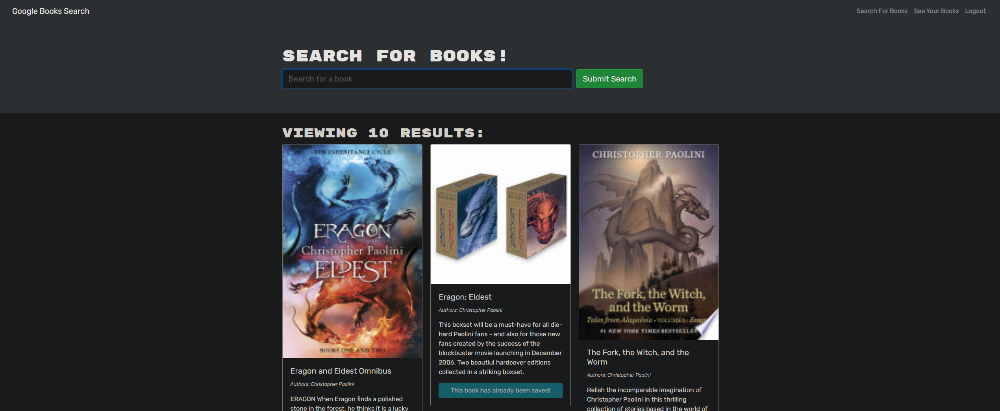

# Book Search Engine

## Description

Web application that lets the user search for books through an api. The user can save books to their account by clicking the "save" button below the book while logged in. If the user clicks on "See Your Books," they can see all the books they have saved and delete books with the button on the page.

## Repository

[https://github.com/JoeyGitsIt/booksearchengine](https://github.com/JoeyGitsIt/booksearchengine)

## Deployed Link

[https://book-search-engine-12312.herokuapp.com/](https://book-search-engine-12312.herokuapp.com/)

## Screenshot

## Installation

Install npm packages with:

`npm i`

To run the app:

`npm start`
